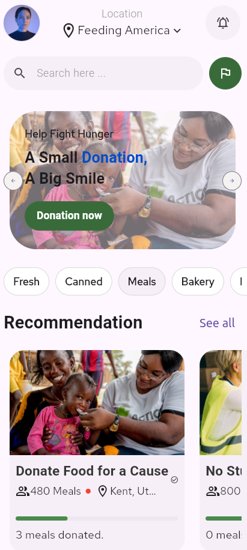

# Projet Flutter Académique

## 📝 Description
Ce projet est une application mobile développée dans le cadre d'un projet de classe. L'objectif principal est de créer une plateforme intuitive permettant aux utilisateurs de faire des dons pour soutenir les personnes en situation de précarité. 

Ce projet sert de support pratique pour maîtriser les concepts fondamentaux du développement avec Flutter.

## 🎯 Objectifs Pédagogiques
L'élaboration de cette application a permis d'approfondir les points suivants :
* **Gestion des Widgets** : Différenciation et utilisation des `StatelessWidget` (pour les interfaces statiques) et des `StatefulWidget` (pour les composants interactifs et dynamiques).
* **Navigation & Routage** : Mise en place d'une navigation fluide entre les différentes pages (Accueil, Détails du don, Formulaire).
* **UI/UX Design** : Manipulation des **icônes** (`Icons`), intégration d'**images** (assets et network).
* **Mise en page** : Utilisation des Layouts (Column, Row, Stack).

## ✨ Fonctionnalités
- **Écran d'accueil** : Présentation des différentes causes disponibles.
- **Détails de la cause** : Informations spécifiques sur le projet de donation sélectionné.
- **Système de Don** : Interface interactive permettant de choisir un montant.

## 📸 Aperçu

## 🚀 Installation et Lancement
  1. **Cloner le projet** :
   ```bash
   git clone [https://github.com/repsorp39/The-Flutter-Class-Project](https://github.com/repsorp39/The-Flutter-Class-Project)
   ```

   2. **Installer les dépendances et démarrer** :
   ```bash
   flutter pub get
  
   flutter run
   ```